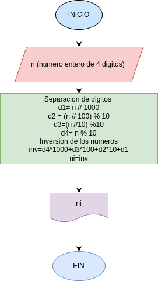

# Inversion
Programa diseñado para invertirnumeros enteros de 4 digitos
### ¿Como funciona?
- por medio de divisiones se obtiienen los 4 digitos (cada uno de los numeros escritos, separados uno po uno )
- el programa no acepta numeros decimales
# Diagrama de flujo 
